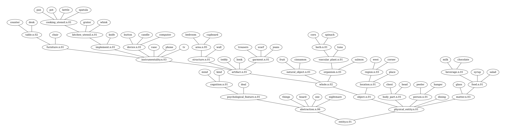

# Leveraging Class Abstractions for Commonsense Reinforcement Learning via Residual Policy Gradient Methods

The code for the experiments presented in the paper: [Leveraging Class Abstractions for Commonsense Reinforcement Learning via Residual Policy Gradient Methods](https://www.ijcai.org/proceedings/2022/0423.pdf).

Experiments were conducted in the following environments:

* Toy environment (for testing purposes)
* [Wordcraft](https://github.com/minqi/wordcraft)
* [Textworld Commonsense](https://github.com/IBM/commonsense-rl)

Each environment has its own directory that can be found in the src directory containing the dependencies to run the code and instructions to replicate the experiments conducted in the paper.

