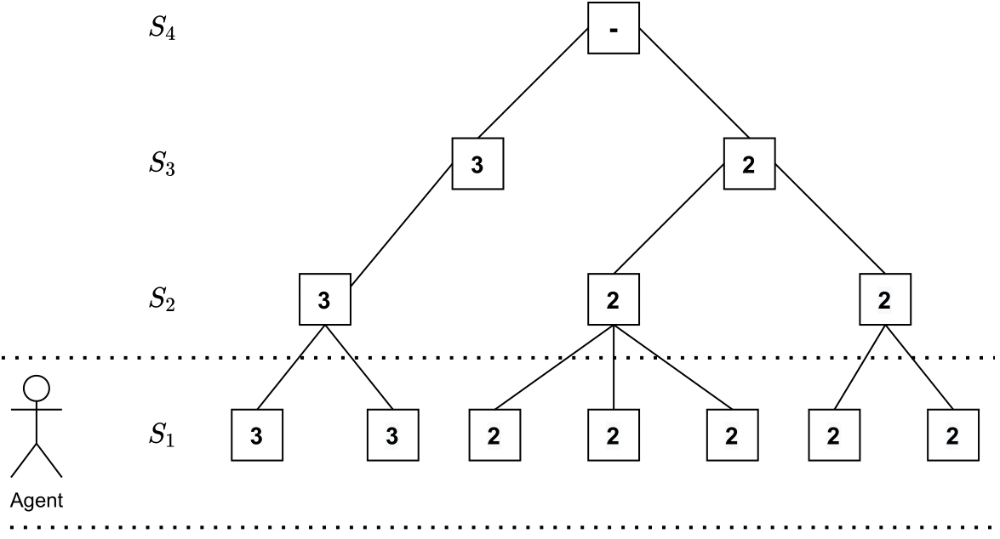

# Toy Environment 

The toy environment is designed to test whether the residual and sum algorithm can leverage abstract states to generalize to unseen states and learn with less samples. For more information about the environment see the [paper](https://arxiv.org/pdf/2201.12126.pdf).




## Dependencies 

Prerequisites: python3.8, venv

From inside the toy directory run the following code.

```
python3 -m venv ./env
source ./env/bin/activate
pip install -r requirements.txt
```

## Running experiments 

As base algorithms DQN and REINFORCE with baseline are implemented. Then simply run:

```
bash run.sh dqn 5
```

The first argument specifies the algorithm (dqn/reinforce) and the second one the number of seeds. This will create a run folder in the log directory that contains the results for each seed. Logs are stored in a tensorboard file. 

## Experiments from the paper 

To replicate the conditions investigated you need to choose a method and a type of environment you want to test.


To choose a method set the following parameters in the configuration files (training_parameters section):

1. residual:

    * learning_alg: 'residual'
    * true_abstraction: False
    * base: False

2. sum:

    * learning_alg: 'residual'
    * true_abstraction: False
    * base: False

3. base (no abstraction is used as input):

    * learning_alg: 'sum'
    * true_abstraction: False
    * base: True

4. oracle (only the correct abstraction layer is used):

    * learning_alg: 'sum'
    * true_abstraction: True
    * base: False

To choose a type of environment set the following parameters in the environment section of the configuration file. The number of samples used for each type of environment can be set under training parameters:

1. Basic (n_samples=5000)

    * branching_per_layer: [7,10,8,8]
    * noise_prob: 0

2. Noise (n_samples=10000)

    * branching_per_layer: [7,10,8,8]
    * noise_prob: 0.5

3. Ambiguous (n_samples=2000)

    * branching_per_layer: [7,10,8,1]
    * noise_prob: 0

## Visualizing the environment 
If the visualize flag in the config files is set to True, there will be an image of the state-tree created by the environment in the log folder of the run.
